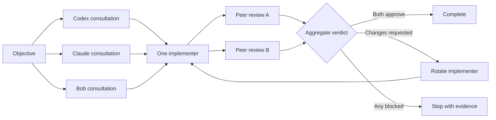

# Codex + Claude + Bob Agent Loop

A reusable, dependency-free project template that makes Codex, Claude Code, and Bob Shell work as an auditable engineering team. All three agents form independent opinions in parallel, one implements, and the other two review independently. Approval requires both reviewers.

**Created by Bruney for Bruney.**

## Why this exists

Agent instruction files provide durable context, but they do not create process-to-process communication. This template adds a small Python coordinator that passes every agent's output to its peers, persists each handoff, runs two reviews in parallel, and prevents multiple agents from editing the same working tree simultaneously.



## What is included

- Shared instructions in `AGENTS.md`, plus native project rules for Claude Code and Bob Shell.
- Durable cross-agent knowledge in `MEMORY.md`.
- A documented state machine and handoff contract in `docs/AGENT_PROTOCOL.md`.
- Explicit no-approval invocation for all three CLIs.
- Three parallel, read-only consultations followed by serialized implementation.
- Two independent, parallel reviews with unanimous approval.
- Equal peer capabilities: any agent can implement or review with the same effective repository authority.
- Balanced role rotation with no permanent product preference.
- Local JSONL transcripts and per-turn prompt, response, and process logs.
- Timeouts, failure-artifact retention, strict verdict parsing, and a maximum-round guard.
- Offline deterministic tests and an optional three-agent live handshake.
- No runtime Python dependencies.

## Requirements

- Python 3.10 or newer
- Git
- [Codex CLI](https://learn.chatgpt.com/docs/codex/quickstart) installed and authenticated
- [Claude Code](https://code.claude.com/docs/en/quickstart) installed and authenticated
- [IBM Bob](https://www.ibm.com/products/bob) / Bob Shell installed and authenticated

This template has been exercised with Codex CLI `0.155.1`, Claude Code `2.1.280`, and Bob Shell `1.0.6`. Newer compatible versions should work, but CLI flags can change.

## Quick start

Keep all three agents in the same trusted repository, then run:

```bash
python3 -m unittest discover -s tests -v
python3 -m agent_loop doctor
python3 -m agent_loop smoke-test
```

The unit suite tests the coordinator without model calls. `doctor` validates the repository and all three CLI installations. `smoke-test` makes one minimal live call to each authenticated agent and verifies that Codex, Claude, and Bob can load the shared project context.

Start a development loop with an inline objective:

```bash
python3 -m agent_loop run \
  --live \
  "Add pagination to the API, include focused tests, and update the documentation."
```

The user can also tell an active coding agent: `Use Agent Coordinator: <objective>`. Ordinary requests remain single-agent, and coordinator child turns cannot recursively launch new loops.

Use an objective file:

```bash
python3 -m agent_loop run --objective-file examples/objective.md --max-rounds 4
```

Choose Bob as the first implementer or change the per-agent timeout:

```bash
python3 -m agent_loop run \
  --first bob \
  --timeout 2400 \
  "Refactor the parser without changing its public behavior."
```

Inspect the latest local session:

```bash
python3 -m agent_loop status
```

## Real-time communication log

Use `--live` to print every phase transition, completed agent response, individual verdict, and aggregate verdict to the terminal while preserving the final JSON result on standard output:

```bash
python3 -m agent_loop run --live "Your objective"
```

To follow the same communication from a second terminal:

```bash
python3 -m agent_loop watch
```

Watch a specific session or print its current log without waiting:

```bash
python3 -m agent_loop watch --session 20260923T030128Z-cf4d9e7f
python3 -m agent_loop watch --no-follow
```

The readable stream is saved as `live.log`. The machine-readable source remains `transcript.jsonl`. Output is emitted when an agent completes a handoff; the coordinator does not expose private chain-of-thought or raw token-by-token reasoning.

The wrapper provides the same commands from any working directory:

```bash
./scripts/agent-loop doctor
./scripts/agent-loop run "Your objective"
```

## How communication works

Each run creates `.agent-loop/sessions/<session-id>/`, which is ignored by Git:

```text
session.json       Current state and aggregate verdict
objective.md       Original objective
transcript.jsonl   Ordered event ledger
live.log           Human-readable live communication stream
prompts/           Exact prompts sent to each agent
responses/         Consultations, handoffs, and reviews
logs/              Commands, exit status, stdout, and stderr
```

All three consultations run concurrently and are read-only. The implementer receives all three opinions. The two remaining agents review the actual working tree independently and in parallel. Both reviewers must approve. Any requested change, together with both reviews, becomes direct context for the next implementer in the Codex → Claude → Bob rotation.

Each reviewer must emit one final verdict:

```text
VERDICT: APPROVED
VERDICT: CHANGES_REQUESTED
VERDICT: BLOCKED
```

A missing, malformed, duplicated, or non-final verdict becomes `CHANGES_REQUESTED`. One `BLOCKED` result stops the loop. `APPROVED` is accepted only when both peer reviewers approve.

## No-approval mode

Codex starts with:

```text
codex exec --dangerously-bypass-approvals-and-sandbox ...
```

Claude Code starts with:

```text
claude --print --dangerously-skip-permissions --permission-prompts none ...
```

Bob Shell starts with:

```text
bob --chat-mode code --trust --approval-mode yolo ...
```

Repository configuration is stored in `.codex/`, `.claude/`, and `.bob/`. The coordinator still passes no-approval options on every call so automation does not depend on mutable user settings. Bob's `--approval-mode yolo` enables file modifications and automatically accepts actions; `--trust` marks the shared workspace trusted. Bob rejects combining this option with the legacy `--yolo` alias, so the coordinator passes only the explicit approval mode.

The products use different flag names, but the effective authority is symmetric: each can inspect, edit, run tests, and use its normal tools. Read-only consultation and review behavior is a protocol constraint applied equally by role.

> [!WARNING]
> No-approval mode removes a major safety boundary. Run it only in repositories you trust, ideally inside an isolated container or virtual machine. Read [SECURITY.md](SECURITY.md). Disabling prompts does not expand the objective or authorize destructive, external, or unrelated work.

## Adapting the template

1. Copy these files into the target repository.
2. Replace the generic verification commands in `AGENTS.md` with the project's real commands.
3. Add stable architecture facts and constraints to `MEMORY.md`.
4. Keep secrets and transient task status out of committed instruction files.
5. Run the offline tests and three-agent smoke test.
6. Commit the base before starting a live loop so changes remain recoverable.

For an existing repository, merge the coordination sections into current instructions instead of overwriting project-specific rules.

## Custom CLI commands

If an executable is not on `PATH`, or you use wrappers, set:

```bash
export AGENT_LOOP_CODEX_COMMAND="/absolute/path/to/codex"
export AGENT_LOOP_CLAUDE_COMMAND="/absolute/path/to/claude"
export AGENT_LOOP_BOB_COMMAND="/absolute/path/to/bob"
python3 -m agent_loop doctor
```

Values are parsed as command lines, so wrappers with fixed arguments are supported. Do not place API keys in these variables; commands are written to local session logs.

## Design boundaries

- Parallelism is used only for read-only consultation and review. Writes are serialized because all agents share one working tree.
- The coordinator transports context and aggregates explicit verdicts; it does not judge code quality.
- `MEMORY.md` is curated durable knowledge, not a transcript or secret store.
- Agent instructions guide behavior but do not enforce operating-system security.
- Publishing, deployment, and destructive operations remain outside the loop unless the objective explicitly includes them.

## Official references

- OpenAI: [Custom instructions with AGENTS.md](https://learn.chatgpt.com/docs/agent-configuration/agents-md)
- OpenAI: [Codex non-interactive mode](https://learn.chatgpt.com/docs/non-interactive-mode)
- OpenAI: [Codex configuration basics](https://learn.chatgpt.com/docs/config-file/config-basic)
- OpenAI: [Agent approvals and security](https://learn.chatgpt.com/docs/agent-approvals-security)
- Anthropic: [Claude Code memory and CLAUDE.md](https://code.claude.com/docs/en/memory)
- Anthropic: [Claude Code settings](https://code.claude.com/docs/en/settings)
- Anthropic: [Claude Code permissions](https://code.claude.com/docs/en/permissions)
- Anthropic: [Claude Code CLI reference](https://code.claude.com/docs/en/cli-reference)
- IBM: [Bob product page](https://www.ibm.com/products/bob)

## License

MIT. See [LICENSE](LICENSE).
