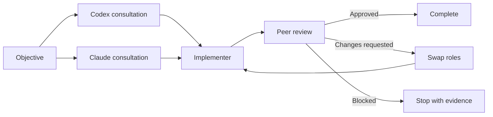

# Codex + Claude Agent Loop

A reusable, dependency-free project template that makes Codex and Claude Code work as an auditable engineering pair. Both agents form independent opinions in parallel, then alternate implementation and review turns until the reviewer approves, reports a blocker, or the configured round limit is reached.

**Created by Bruney for Bruney.**

## Why this exists

`AGENTS.md` and `CLAUDE.md` provide durable instructions, but instruction files alone do not create process-to-process communication. This template adds a small Python coordinator that passes each agent's output to the other, persists every handoff, enforces read-only review turns, and prevents two agents from editing the same working tree simultaneously.



## What is included

- Shared instructions in `AGENTS.md`, with a Claude-specific entry point in `CLAUDE.md`.
- Durable cross-agent knowledge in `MEMORY.md`.
- A documented state machine and handoff contract in `docs/AGENT_PROTOCOL.md`.
- Explicit no-approval CLI invocation for both agents.
- Parallel, read-only consultation followed by serialized editing and peer review.
- Equal peer capabilities: either agent can implement or review with the same effective repository authority.
- Balanced roles: the first implementer is selected automatically without a permanent product preference; requested changes swap the roles.
- Local, append-only JSONL transcripts and per-turn prompt, response, and process logs.
- Timeouts, nonzero-exit handling, strict verdict parsing, and a maximum-round guard.
- Offline tests with deterministic fake agents, plus an optional live handshake test.
- No runtime Python dependencies.

## Requirements

- Python 3.10 or newer
- Git
- [Codex CLI](https://learn.chatgpt.com/docs/codex/quickstart) installed and authenticated
- [Claude Code](https://code.claude.com/docs/en/quickstart) installed and authenticated

This template has been exercised with Codex CLI `0.155.1` and Claude Code `2.1.280`. Newer compatible versions should work, but their command-line flags can change.

## Quick start

Clone or copy the template into a trusted project, then run:

```bash
python3 -m unittest discover -s tests -v
python3 -m agent_loop doctor
python3 -m agent_loop smoke-test
```

The first command tests the coordinator without model calls. `doctor` validates the repository, instructions, and CLI installations. `smoke-test` makes one minimal live call to each authenticated agent and verifies both can read the project context.

Start a development loop with an inline objective:

```bash
python3 -m agent_loop run \
  "Add pagination to the API, include focused tests, and update the documentation."
```

The user can also tell an active coding agent: `Use Agent Coordinator: <objective>`. Repository instructions require ordinary requests to remain single-agent and prevent child turns from recursively launching new loops.

Or keep a longer objective in a file:

```bash
python3 -m agent_loop run --objective-file examples/objective.md --max-rounds 4
```

Choose Claude as the first implementer or change the per-agent timeout:

```bash
python3 -m agent_loop run \
  --first claude \
  --timeout 2400 \
  "Refactor the parser without changing its public behavior."
```

Inspect the latest session:

```bash
python3 -m agent_loop status
```

The `scripts/agent-loop` wrapper provides the same commands from any working directory:

```bash
./scripts/agent-loop doctor
./scripts/agent-loop run "Your objective"
```

## How communication works

Each run creates `.agent-loop/sessions/<session-id>/`, which is ignored by Git:

```text
session.json       Current state and final verdict
objective.md       Original objective
transcript.jsonl   Ordered event ledger
prompts/           Exact prompts sent to each agent
responses/         Agent handoffs and reviews
logs/              Commands, exit status, stdout, and stderr
```

Both consultations run concurrently and are read-only. The first implementer receives both opinions. The reviewer receives the implementation handoff but must verify it against the actual diff. A requested change becomes direct context for the other agent's implementation turn. This creates explicit dependency without unsafe concurrent writes.

The coordinator recognizes only these review verdicts:

```text
VERDICT: APPROVED
VERDICT: CHANGES_REQUESTED
VERDICT: BLOCKED
```

A missing or malformed verdict is treated as `CHANGES_REQUESTED`, never as approval.

## No-approval mode

The coordinator starts Codex with:

```text
codex exec --dangerously-bypass-approvals-and-sandbox ...
```

It starts Claude Code with:

```text
claude --print --dangerously-skip-permissions --permission-prompts none ...
```

The repository also contains `.codex/config.toml` with `approval_policy = "never"` and `sandbox_mode = "danger-full-access"`. The command-line flags are still passed explicitly so automated runs do not depend on project-trust configuration loading.

Claude Code intentionally does not receive `bypassPermissions` from `.claude/settings.json`. Current Claude Code documentation states that `permissions.defaultMode = "bypassPermissions"` does not take effect from project or local settings; it must come from user/managed settings or the CLI. The coordinator therefore supplies the CLI option on every turn.

The products use different flag names, but the effective authority is symmetric: both can inspect, edit, run tests, and use their normal tools. Read-only review behavior is an equal protocol constraint, not a weaker Claude or Codex configuration.

> [!WARNING]
> No-approval mode removes a major safety boundary. Run it only in repositories you trust, ideally inside an isolated container or virtual machine. Read [SECURITY.md](SECURITY.md) before using the live loop. Disabling prompts does not expand the objective or authorize destructive, external, or unrelated work.

## Adapting the template to a project

1. Copy these files into the new repository.
2. Replace the generic verification commands in `AGENTS.md` with the project's real commands.
3. Add stable architecture facts and constraints to `MEMORY.md`.
4. Keep secrets and transient task status out of committed instruction files.
5. Run the offline tests and both-agent smoke test.
6. Commit the base before starting a live loop so changes remain recoverable.

For an existing repository, preserve any current `AGENTS.md` or `CLAUDE.md` guidance and merge the coordination sections instead of overwriting project-specific rules.

## Custom CLI commands

If the executables are not on `PATH`, or you use wrappers, set:

```bash
export AGENT_LOOP_CODEX_COMMAND="/absolute/path/to/codex"
export AGENT_LOOP_CLAUDE_COMMAND="/absolute/path/to/claude"
python3 -m agent_loop doctor
```

The values are parsed as command lines, so a wrapper with fixed arguments is also supported. Do not put API keys in these variables; process commands are written to local session logs.

## Design boundaries

- Parallelism is used for independent read-only analysis. Writes are serialized because both agents share one working tree.
- The coordinator transports context and state; it does not judge code quality.
- `MEMORY.md` is curated durable knowledge, not a transcript or secret store.
- Agent instruction files guide behavior but do not enforce operating-system security.
- Publishing, deployment, and destructive operations remain outside the loop unless the objective explicitly includes them.

## Official references

The template follows these current product behaviors:

- OpenAI: [Custom instructions with AGENTS.md](https://learn.chatgpt.com/docs/agent-configuration/agents-md)
- OpenAI: [Codex non-interactive mode](https://learn.chatgpt.com/docs/non-interactive-mode)
- OpenAI: [Codex configuration basics](https://learn.chatgpt.com/docs/config-file/config-basic)
- OpenAI: [Agent approvals and security](https://learn.chatgpt.com/docs/agent-approvals-security)
- Anthropic: [Claude Code memory and CLAUDE.md](https://code.claude.com/docs/en/memory)
- Anthropic: [Claude Code settings](https://code.claude.com/docs/en/settings)
- Anthropic: [Claude Code permissions](https://code.claude.com/docs/en/permissions)
- Anthropic: [Claude Code CLI reference](https://code.claude.com/docs/en/cli-reference)

## License

MIT. See [LICENSE](LICENSE).
